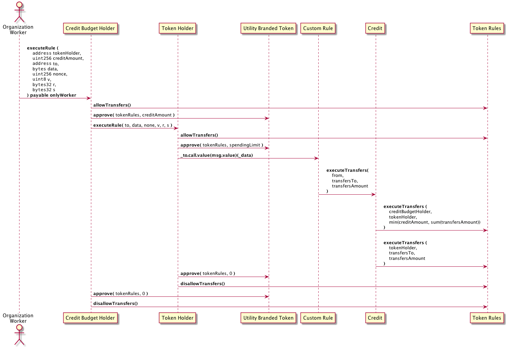
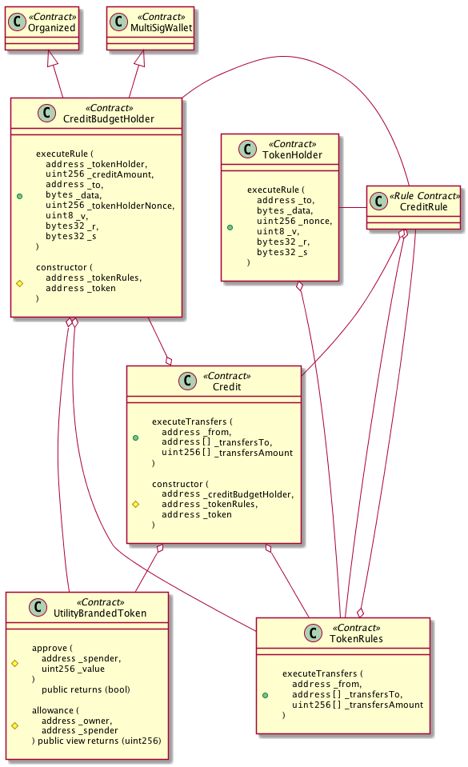

# Credit

## Simple Summary

<!--"If you can't explain it simply, you don't understand it well enough."
Provide a simplified and layman-accessible explanation of the OIP.-->
The current OIP introduces a crediting feature that allows an organization to
incentivize economy participants to interact within its application,
by distributing tokens that could be spent only within the current economy.

## Abstract

<!--A short (~200 word) description of the technical issue being addressed.-->
The current OIP develops a new set of smart contracts that allows
implementation of a crediting workflow by economy admins. The proposed solution
should extend the existing token economy contracts and do not alter interfaces
and implementations of existing ones. Loose coupling between components
should be carried on.

## Specification

<!--The technical specification should describe the syntax and semantics of any
new feature. The specification should be detailed enough to allow competing,
interoperable implementations.-->

The current OIP proposes a set of contracts to enable the crediting feature by
economy admins. The following contracts taking part in the proposed
workflow already exists in the openst-contracts and stay unchanged with
regards to the interfaces and implementations:

- TokenHolder
- TokenRules
- UtilityBrandedToken

The following contracts and a rule contract template gets introduced:

- CreditBudgetHolder
- Credit
- Custom Rule (a template contract for crediting)

In the proposal, TokenHolder, TokenRules, and UtilityBrandedToken do not depend
on Credit and CreditBudgetHolder and are unaware of those new contracts.
This is an essential feature for loose coupling of components.
The only connection with an existing token economy contracts is a custom
rule being aware of Credit contract and delegating the execution of
transfers to it.

### Participants

The following participants are part of the crediting:

Organization Worker (address)

    A whitelisted worker of the organization.

Credit Budget Holder (contract)

    A contract that keeps the organization's budget for crediting.

Token Holder (contract)

    Keeps user's token and execute signed by user ExTx.

Utility Branded Token (contract)

    Utility branded token of the economy. It conforms to EIP20 token interface.

Custom Rule (contract)

    A rule to execute as ExTx (signed by user).

Credit (contract)

    Calculates an amount to send from budget holder contract to user.

Token Rules (contract)

    Token rules contract of the economy.

### UML Sequence Diagram



### UML Class Diagram



### Contract Interfaces

```solidity

/**
 * Contract keeps a crediting budget of an organization.
 *
 * Contract's executeRule() function approves TokenRules as a spender for the
 * crediting amount and delegates a rule execution farther to TokenHolder of
 * the specified user. Down in the execution path, a `Credit` contract
 * transfers (through the TokenRules) to the user's TokenHolder account the
 * credit amount before transfering an amount during a rule execution.
 */
contract CreditBudgetHolder is Organized, is MultiSigWallet {

    /**
     * @param _multisig Multisig contract address to handle ownership.
     * @param _tokenRules TokenRules address of the economy.
     * @param _token Utility branded token address of the economy.
     * @param _organization Address of an organization.
     */
     constructor(
         address _tokenRules,
         address _token,
         address _organization
     )
        public;

    /**
     * Approves the TokenRules as a spender for the specified credit amount
     * and delegates rule execution to user's TokenHolder contract.
     *
     * Function is payable to pass a value to the TokenHolder::executeRule
     * function (msg.value).
     *
     * Contract is `Organized` (is managed by the economy admins), and only
     * organization workers can call the function.
     *
     * The msg.value of this function is propagated down to
     * TokenHolder::executeRule() payable function.
     *
     * @param _tokenHolder The user's TokenHolder address for whom crediting
     *                     for the specified amount should happen first, before
     *                     executing the signed ExTx by the user.
     * @param _creditAmount The amount to credit the user before delegating
     *                      an ExTx execution to the user's TokenHolder.
     * @param _to The custom rule address to execute in the user's TokenHolder
     *            contract.
     * @param _data The custom rule payload to execute in the user's TokenHolder
     *              contract.
     * @param _tokenHolderNonce The user's TokenHolder account's nonce used
     *                          during a rule execution (nonce gets updated
     *                          also in failure).
     * @param _v, _r, _s The user's signature for ExTx.
     *
     * @return _executionStatus Function might fail by throwing an exception
     *                          or returning false. One of the cases for
     *                          this function to return false is the rule
     *                          execution status propagated from
     *                          TokenHolder::executeRule().
     *
     * Function requires:
     *      - _creditAmount is not 0.
     */
    function executeRule(
        address _tokenHolder,
        uint256 _creditAmount,
        address _to,
        bytes _data,
        uint256 _tokenHolderNonce,
        uint8 _v,
        bytes32 _r,
        bytes32 _s
    )
        external
        payable
        onlyWorker
    returns (bool _executionStatus);

    /**
     * Transfers _value amount of utility branded tokens to address _to.
     *
     * Function requiers:
     *      - Only owner can call the function.
     *
     * @param _to Address to transfer tokens.
     * @param _value An amount of tokens to transfer.
     *
     * @return success_ True if transfer is successful, otherwise false.
     */
    function transfer(
        address _to,
        uint256 _value
    )
        external
        onlyOwner
        returns (bool success_);

}
```

```solidity
/**
 * Contract composes CreditBudgetHolder and the user's TokenHolder contracts
 * to facilitate the transfer of the specified amounts to beneficiaries.
 * Contract gives priority to the user's credited amount with regard to
 * transfer to the beneficiaries.
 * To be able to facilitate transfer to the beneficiaries, contract should
 * be registered in TokenRules as a rule.
 */
contract Credit {

    /**
     * @param _creditBudgetHolder The organization's credit budget holder
     *                            address, to use the user's credit first to
     *                            transfer to beneficiaries.
     * @param _tokenRules TokenRules contract address of the economy to
     *                    facilitate transfers.
     * @param _token Utility branded token address of the economy.
     */
    constructor(
        address _creditBudgetHolder,
        address _tokenRules,
        address _token
    )
        public;

    /**
     * Make transfers to beneficiaries first from the user's credit budget and
     * the remaining part from the user's TokenHolder account.
     *
     * In the current proposal, the user's credit amount is retrieved
     * from the utility branded token of the economy (specified in this
     * contract constructor) by checking the allowance for TokenRules as a
     * spender for CreditBudgetHolder.
     *
     * First, the function transfers from the organization's CreditBudgetHolder
     * an amount (calculation of the amount defined below) to the user's
     * TokenHolder, after which transfers from the user's TokenHolder account
     * to the beneficiaries.
     *
     * An amount to transfer from the CreditBudgetHolder to the user's
     * TokenHolder is calculated with the following formula:
     *      credit_amount = _token.allowance(_creditBudgetHolder, _tokenRules);
     *      amount_to_transfer = min(credit_amount, sum(_transfersAmount))
     *
     * Function requires:
     *      - Length of _transfersTo and _transfersAmount arrays is equal.
     *
     * @param _from The user's TokenHolder address.
     * @param _transfersTo List of addresses to transfer from the user's
     *                     TokenHolder.
     * @param _transfersAmount List of amounts to transfer from the users's
     *                         TokenHolder
     */
    function executeTransfers {
        address _from,
        address[] _transfersTo,
        uint256[] _transfersAmount
    }

}
```